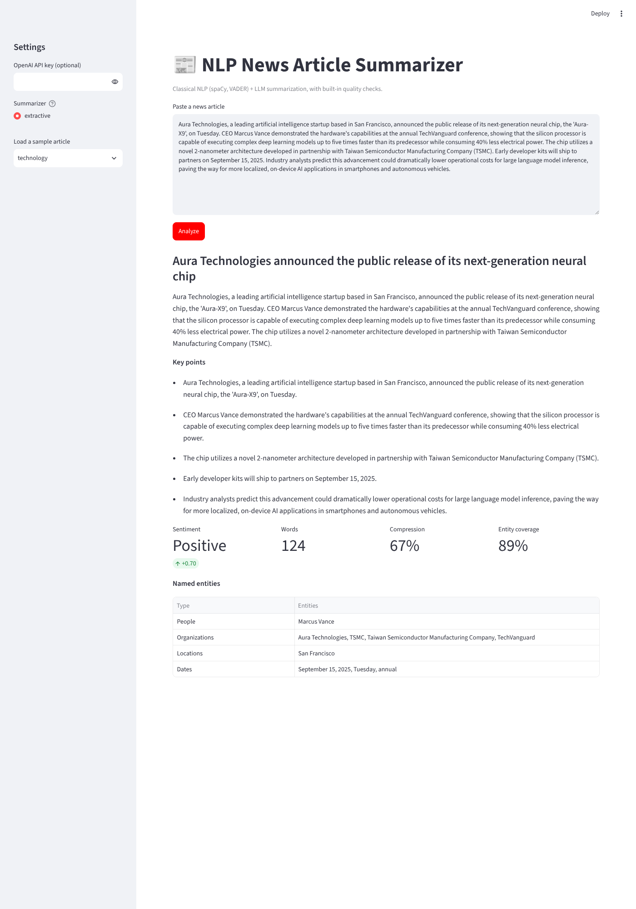

# NLP-based News Article Summarizer

[](https://github.com/hvs515/MUJ-DS-23FE10CDS00400/actions/workflows/tests.yml)
<a href="https://colab.research.google.com/github/hvs515/MUJ-DS-23FE10CDS00400/blob/main/notebooks/news.ipynb"></a>

Capstone project for the **Batch F NLP training program**. The system takes a raw news article and returns a headline, a summary, five key points, sentiment, named entities, text statistics, and automatic checks on the quality of the summary.

## Student details

| Field | Value |
|---|---|
| Name | Harshvardhan Saxena |
| Registration Number | 23FE10CDS00400 |
| Branch | _<your branch>_ |
| Batch | F |
| Project Title | NLP-based News Article Summarizer |
| GitHub Username | [hvs515](https://github.com/hvs515) |
| Instructor | [sandeepmbm](https://github.com/sandeepmbm) |
| Training Program | _<program name>_ – NLP Capstone |
| Capstone (team) repository | _<link to team capstone repo>_ |

## Features

- **Classical NLP** with spaCy and NLTK: text cleaning, sentence and word statistics, VADER sentiment, and named-entity recognition (people, organisations, locations, dates).
- **Abstractive summarization** with an LLM (OpenAI `gpt-4o-mini`). The prompt asks for strict JSON and tells the model not to invent facts.
- **Offline extractive summarizer** that works without an API key. It ranks sentences by word frequency, entities and position in the article. It is also used as the baseline.
- **Summary quality checks** that need no reference summary: compression ratio, entity coverage, unigram overlap, and a check that flags numbers in the summary which do not appear in the source.
- **Three ways to use it:** a Streamlit web app, a command-line tool, and a Colab notebook.
- **Automated tests** (pytest) run on every push with GitHub Actions.

## Repository structure

```
.
├── README.md
├── requirements.txt
├── assignments/        # weekly training assignments
├── notebooks/          # Colab notebook (original exploration)
│   └── news.ipynb
├── code/
│   ├── app.py          # Streamlit web app
│   ├── news_summarizer/
│   │   ├── config.py       # settings + API key lookup
│   │   ├── classical.py    # spaCy / VADER analysis
│   │   ├── extractive.py   # offline extractive summarizer
│   │   ├── llm.py          # OpenAI summarizer + prompt
│   │   ├── evaluation.py   # reference-free quality checks
│   │   ├── pipeline.py     # end-to-end pipeline + text report
│   │   └── __main__.py     # CLI
│   └── tests/
├── resources/          # sample articles, references
├── presentations/      # slides for the final demo
└── capstone/           # project report, results, screenshots
```

## How the code works

The code is in `code/news_summarizer/`, with one module per step of the pipeline.

### `config.py`: settings and API key
- `CONFIG` holds the settings:
  - the model, which is `gpt-4o-mini` by default and can be overridden with the `NEWS_SUMMARIZER_MODEL` environment variable
  - the maximum article length (6000 characters)
  - the target summary length (80 words)
  - the temperature (0.2)
  - the number of key points (5)
  - the spaCy models to try, in order of preference
- `get_api_key()` returns the OpenAI key. It first looks in the `OPENAI_API_KEY` environment variable, then in Colab Secrets when running in Google Colab. If it finds neither, it returns `None`.

### `classical.py`: classical NLP
- `get_nlp()` loads `en_core_web_md` if it is installed and falls back to `en_core_web_sm`. The model is loaded once and cached.
- `get_sentiment_analyzer()` creates NLTK's VADER analyzer and downloads its lexicon the first time if needed.
- `clean_text()` collapses all whitespace into single spaces.
- `sentiment_label()` turns the VADER compound score into a label: **Positive** if the score is ≥ 0.05, **Negative** if ≤ −0.05, otherwise **Neutral**.
- `extract_entities()` maps spaCy entity labels into four groups and removes duplicates:
  - `PERSON` → People
  - `ORG` → Organizations
  - `GPE`/`LOC` → Locations
  - `DATE`/`TIME` → Dates
- `analyze_classical_nlp()` returns the character, word and sentence counts, the sentiment scores and label, and the entities.

### `extractive.py`: offline extractive summarizer
This summarizer is the baseline. It is also the fallback when no API key is set, and it needs no internet connection.
- **Sentence scoring** (`_score_sentences`):
  - Each sentence is scored by how often its content words appear in the whole article. Content words exclude stop words and words shorter than 3 letters.
  - The total is divided by √(number of words), so long sentences don't win just by being long.
  - Each named entity in the sentence adds a small bonus.
  - Sentences near the start get a further bonus, because news stories put the main facts first.
- **Summary:** sentences are taken from the highest score down until about 80 words are reached. They are then printed in their original order.
- **Key points:** the 5 highest-scoring sentences, in original order.
- **Headline** (`make_headline`):
  1. Take the first sentence.
  2. Remove the first comma-enclosed aside, for example ", a leading AI startup based in San Francisco,".
  3. Keep only the main clause, up to 18 words.

### `llm.py`: LLM summarizer
- `SYSTEM_PROMPT_TEMPLATE` asks for a JSON object with `summary`, `key_points` and `headline`. It also tells the model not to invent facts, statistics or outside claims.
- `validate_article()` rejects empty articles and articles longer than the maximum length.
- `query_llm_summarizer()` calls the OpenAI Chat Completions API in JSON mode and parses the reply. If the request fails or the reply is not valid JSON, it raises a clear `RuntimeError`. You can pass in a `client`, which is how the tests run without a real API key.

### `evaluation.py`: summary quality checks
There are no hand-written reference summaries, so these checks compare the summary only with the source article:
- **Compression ratio:** summary words divided by article words.
- **Entity coverage:** the share of the article's named entities that also appear in the summary.
- **Unsupported numbers:** numbers in the summary that never appear in the article. In news, a wrong number is the most harmful kind of made-up fact, and this is a cheap way to catch it.
- **Unigram precision and recall:** the overlap of single words between the summary and the article, similar to ROUGE-1.

### `pipeline.py`: putting it together
- `analyze_article(text, mode)` validates the input, runs the classical NLP, summarizes and evaluates. The `mode` can be:
  - `"llm"`: use OpenAI
  - `"extractive"`: use the offline summarizer
  - `"auto"`: use the LLM if an API key or client is available, otherwise the extractive summarizer
- `format_report()` turns the result into the plain-text report the CLI prints.

### `__main__.py`: command-line tool
It reads an article from one of four sources:
- `--file`: a text file
- `--text`: text passed on the command line
- `--sample`: one of the bundled samples in `resources/sample_articles.json`
- `--all-samples`: every bundled sample

It prints a report for each article and can also save the raw results with `--json-out`.

### `code/app.py`: Streamlit web app
- The sidebar has an optional API key field, the summarizer choice and a sample picker. The LLM option only appears when a key is available.
- The main page shows the headline, summary, key points, sentiment, word count, compression and entity coverage, and a table of entities.
- It shows a warning if the summary contains numbers that are not in the article.

### `code/tests/test_pipeline.py`: tests
- `FakeClient` stands in for `openai.OpenAI`, so the LLM tests never make network calls or need a key.
- The extractive tests check that every key point is copied word for word from the source article.
- The remaining tests cover:
  - text cleaning
  - sentiment thresholds
  - NER on known names
  - rejecting empty or overlong input
  - handling invalid JSON from the LLM
  - detecting unsupported numbers
  - the full pipeline in both modes

## Installation guide

Requirements: Python 3.10 or newer.

```bash
git clone https://github.com/hvs515/MUJ-DS-23FE10CDS00400.git
cd MUJ-DS-23FE10CDS00400
python -m venv .venv
source .venv/bin/activate          # Windows: .venv\Scripts\activate
pip install -r requirements.txt
python -m spacy download en_core_web_sm   # or en_core_web_md for better NER
```

Optional: to use the LLM summarizer, set your OpenAI key. Without a key, the project uses the offline extractive summarizer.

```bash
export OPENAI_API_KEY="sk-..."      # Windows PowerShell: $env:OPENAI_API_KEY="sk-..."
```

## Usage

**Web app**

```bash
streamlit run code/app.py
```

**Command line** (run from the `code/` folder)

```bash
cd code
python -m news_summarizer --sample technology
python -m news_summarizer --file my_article.txt --mode llm
python -m news_summarizer --all-samples --mode extractive --json-out results.json
```

**Notebook:** open `notebooks/news.ipynb` in Colab and add `OPENAI_API_KEY` under Colab Secrets.

**Tests**

```bash
python -m pytest -q
```

## Results

The sample outputs are in [`capstone/results/`](capstone/results/), and the screenshots are in [`capstone/screenshots/`](capstone/screenshots/). These are the results of the extractive baseline on the three bundled articles:

| Article | Summary words | Compression | Entity coverage | Unsupported numbers |
|---|---|---|---|---|
| Politics | 73 | 0.55 | 90% | none |
| Technology | 83 | 0.67 | 89% | none |
| Business | 71 | 0.56 | 80% | none |



See the [project report](capstone/README.md) for the method, the evaluation and the limitations.

## Contributing

We work on feature branches and merge through reviewed pull requests. See [CONTRIBUTING.md](CONTRIBUTING.md).
